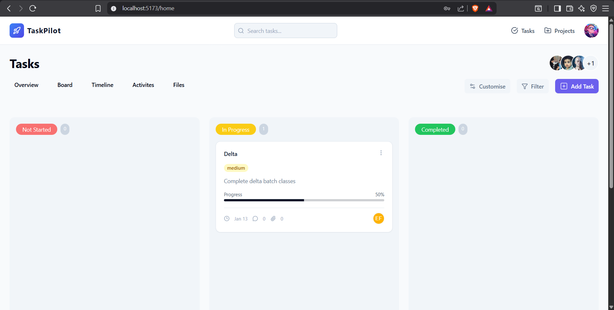

# TaskPilot - Smart Task Management App

<div align="center">

  <h3>
    🚀 <a href="https://taskpilot-bice.vercel.app/">View Live Demo</a> 🚀
  </h3>

  <p>
    A modern, responsive Task Management Dashboard built with the <b>MERN Stack</b>. 
    Manage your daily tasks efficiently with status tracking, categorization, and a clean UI.
  </p>

</div>

---

## 📋 Table of Contents

- [Features](#-features)
- [Tech Stack](#-tech-stack)
- [Project Structure](#-project-structure)
- [Installation](#-installation)
- [Environment Variables](#-environment-variables)
- [API Endpoints](#-api-endpoints)
- [Database Schema](#-database-schema)
- [Screenshots](#-screenshots)

---

## ✨ Features

### ✅ Task Management
- **Create Tasks**: Add new tasks with title, description, due date, and priority.
- **Status Tracking**: Organize tasks by status (Todo, In Progress, Completed).
- **Edit & Delete**: Full control to update or remove tasks.
- **Priority Levels**: Set Low, Medium, or High priority for better sorting.

### 🔐 Authentication & Security
- **User Registration**: Secure sign-up with email validation.
- **JWT Authentication**: Protected routes ensuring only logged-in users access data.
- **Password Encryption**: Secure hashing using bcrypt.

### 🎨 UI/UX
- **Responsive Design**: Fully optimized for Desktop, Tablet, and Mobile.
- **Modern Interface**: Built with **Tailwind CSS** and **Shadcn/UI** components.
- **Skeleton Loading**: Smooth loading states for better experience.
- **Toast Notifications**: Real-time feedback for actions (Success/Error).

---

## 🛠 Tech Stack

### Frontend
- **Framework**: React.js (Vite)
- **Styling**: Tailwind CSS
- **Components**: Shadcn/UI & Lucide React (Icons)
- **State Management**: React Context API
- **HTTP Client**: Axios

### Backend
- **Runtime**: Node.js
- **Framework**: Express.js
- **Database**: MongoDB (Mongoose)
- **Authentication**: JSON Web Token (JWT)
- **Security**: Cors, Helmet, Bcrypt

---

## 📁 Project Structure

```text
TaskPilot/
├── Backend/
│   ├── controllers/       # Task & Auth Controllers
│   ├── models/            # Mongoose Schemas (User, Task)
│   ├── routes/            # API Routes
│   ├── middlewares/       # Auth Middleware
│   ├── index.js           # Server Entry Point
│   └── .env               # Secrets
│
├── Frontend/
│   ├── src/
│   │   ├── components/    # Reusable UI Components
│   │   ├── pages/         # Dashboard, Login, Signup
│   │   ├── context/       # AuthContext
│   │   ├── utils/         # Axios Instance
│   │   ├── App.jsx        # Main App
│   │   └── main.jsx       # Entry Point
│   └── .env               # Frontend Config
```
## 📦 Prerequisites

- **Node.js** (v14 or higher)
- **npm** or **yarn** package manager
- **MongoDB** (local or cloud instance)
- **Git** (for version control)
---

## 🚀 Installation

### 1. Clone the Repository

```bash
git clone https://github.com/amarsingh789/Cantilever/tree/main
cd "TaskPilot"
```

### 2. Backend Setup

Navigate to the Backend folder:

```bash
cd Backend
```

Install dependencies:

```bash
npm install
```

Create `.env` file:

```bash
PORT=4000
MONGODB_URI=your_mongodb_connection_string
JWT_SECRET=your_secret_key
NODE_ENV=development
```
### 3. Frontend Setup

Navigate to the Frontend folder:

```bash
cd Frontend
```

Install dependencies:

```bash
npm install
```

Create `.env` file:

```bash
VITE_API_URL=http://localhost:4000
```

---

## ⚙️ Configuration

### Backend `.env` Variables

```env
PORT=4000                           # Server port (default 8080)
MONGODB_URI=mongodb://127.0.0.1:27017/TaskPilot  # MongoDB connection string
JWT_SECRET=your_secret_key          # Secret key for JWT signing (use strong, random value)
NODE_ENV=development                # Environment (development/production)
```

### Frontend `.env` Variables

```env
VITE_API_URL=http://localhost:4000  # Backend API base URL
```

**Note**: Change `VITE_API_URL` to your production backend URL when deploying.

---

## ▶️ Running the Application

### Start MongoDB

Ensure MongoDB is running on your system:

```bash
# On Windows (if using MongoDB as a service)
net start MongoDB

# Or run MongoDB locally
mongod
```

### Start Backend Server

From the `Backend` folder:

```bash
npm start
# or
npm run dev
```

Server will start on `http://localhost:4000`

### Start Frontend Development Server

From the `Frontend` folder:

```bash
npm run dev
```

Frontend will open at `http://localhost:5173` (Vite default)

---

## Deployment

This project is configured for cloud deployment.
**Backend (Render)**

- Push code to GitHub.
- Create a Web Service on Render.
- Connect your repository and set Root Directory to Backend.
- Add Environment Variables in Render Dashboard:
- MONGODB_URI, JWT_SECRET, CLOUDINARY_CLOUD_NAME, CLOUDINARY_API_KEY, CLOUDINARY_API_SECRET.

**Frontend (Vercel)**

- Create a New Site from Git on Vercel.
- Set Base directory to Frontend.
- Set Build command to npm run build.
- Set Publish directory to dist.
- Add Environment Variable:
- VITE_BASE_URL = https://taskpilot-sp97.onrender.com/

## 🔗 API Endpoints
**Auth Routes**
- POST /api/auth/register - Register a new user
- POST /api/auth/login - Login user
- GET /api/auth/me - Get current user profile

**Task Routes**
- GET /api/tasks - Get all tasks for logged-in user
- POST /api/tasks - Create a new task
- PUT /api/tasks/:id - Update a task (Status/Content)
- DELETE /api/tasks/:id - Delete a task

---
## 🗄️ Database Schema
**User Schema**

```
{
  username: { type: String, required: true },
  email: { type: String, required: true, unique: true },
  password: { type: String, required: true }
}
```
**Task Schema**
```
{
  title: { type: String, required: true },
  description: { type: String },
  status: { 
    type: String, 
    enum: ['todo', 'in-progress', 'completed'], 
    default: 'todo' 
  },
  priority: {
    type: String,
    enum: ['low', 'medium', 'high'],
    default: 'medium'
  },
  user: { type: ObjectId, ref: 'User' },
  createdAt: Date
}
```
## 📸 Screenshots


## 🤝 Contributing
- Fork the repo.
- Create a new branch (git checkout -b feature-name).
- Commit your changes.
- Push to the branch.
- Open a Pull Request.
## 📄 License
This project is licensed under the MIT License.